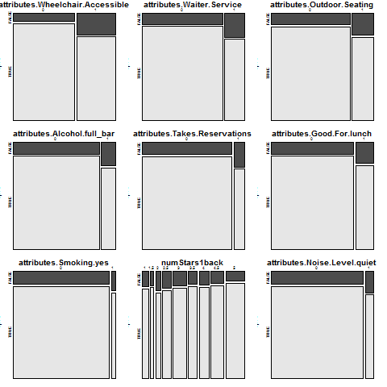
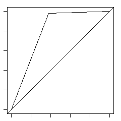

###Predicting Whether a Yelp Business is at Risk of Closing
#####M W Hertneck
#####November 21, 2015

###Introduction

Data from the <a href="http://www.yelp.com/dataset_challenge">Yelp Data Challenge</a> was presented for analysis as the Coursera Data Science Specialization capstone project (October 2015).  Students were instructed to formulate a question to address through inferential or predictive analysis of the data.[^1]   

Approximately 12% of companies available in the Yelp data are no longer in business.  Question: Using the Yelp dataset, can a company's open or closed status be determined by variables, such as:  

*  number of stars or frequency of a business review  
*  business attributes, such as a company's noise level or that it is oriented toward children  
*  business type, such as a juice bar or bike shop  

If status can be predicted with some success, this could be the basis of creating an "early warning" signal for businesses that may be at risk of closing or as a mechanism for yelp developers to program an automated inquiry sent to owners or reviewers inquiring about the current status for "at risk" businesses, thus keeping business data updated.  

###Methods and Data

The yelp data used for this analysis consisted of three of the five available datasets in JSON format: Business, Review and Tip.  The datasets included 1.6M reviews and 500K tips by 366K users for 61K businesses in 10 cities internationally.  Over 61,184 businesses were included.  The data spanned approximately ten years.  

In the interest of computational efficiency, the exploration dataset consisted of 677 variables for 8,410 businesses in the city of Phoenix, Arizona.  The datasets used were extracted using R statistical programming language, then subsets of the Phoenix data were created.  Variables in each subset (business.phx, review.phx, tip.phx) were prepared by: 1) creating new variables based on lists within the dataframe structure; 2) creating new variables based on existing data through consolidation, transformation, or aggregation; 3) creating dummy variables where necessary; 4) combining factor levels for some variables; 5) removing variables that contain little or no usable data; and 6) assuring variable formatting and column names were syntactically correct.  Ultimately, 5,858 business  and 57 key variables remained after cleaning.  

Initial exploration included summary statistics and cross-tabulation (using mosaic plots) to determine potential variable differences in businesses that were closed versus those that were open.  Correlations of variables against the business status variable were conducted to determine which variables might serve as good predictors; correlation was also conducted amongst potential predictors to check for (and avoid) multi-collinearity and either combine or eliminate variables to optimize model building.  The results of these explorations will be discussed in the next section.  

Logistic regression using the generalized linear model (glm) was implemented to create a final predictive model because the dependent variable was a binary categorical outcome: either a business was open or closed.  The author considered this a straightforward model with which to start modeling because the initial variables used were in a numeric format and because logistic regression assumptions regarding linearity and normality would not be as stringent.  

Because diagnostic scatterplots are not as useful for improving logistic regression results, The Akaike information criterion (AIC) was used to assess the fit of different models, with a lesser AIC desired.  Initially selected variables were eliminated from the model if the p-value for each variable generated by the Analysis of Variance (ANOVA) was not statistically significant and did not offer any interaction value with other variables.  

###Results

####Data Exploration

The exploratory data consisted of 5,858 Phoenix, Arizona businesses with 635 variables based on frequency of and ratings from reviews, the final review or tip date for each business, and the information about each business (attributes, categories, etc.).  Approximately 13% of the businesses were closed.  Review dates covered a 10-year period ranging from August 3, 2005 to August 1, 2015.  The minimum number of stars for a business was 3 stars, which was also the most common number of stars; the median was 13 stars.  

To determine which variables had higher correlation with the outcome variable and might serve as predictors, the numeric variables were extracted into a subset and the cor() function applied.  Variables that had the highest correlation with the "open" variable (business status) are presented in Figure 1.  Very weak correlation existed between "open" and a few of the other variables, regardless, these variables were added to our initial target set for modeling experiments.  

<b><i><H5 align="center"> Figure 1. Highest Correlated Variables with "open" Variable </H5></b></i>

<!-- html table generated in R 3.2.2 by xtable 1.8-0 package -->
<!-- Wed Nov 18 19:47:05 2015 -->
<table align="center" table border=1>
<tr> <th>VarID  </th> <th> Variable Name </th> <th> Freq </th>  </tr>
  <tr> <td align="right" td style="padding: 0px 1px 0px 1px"> 616 </td> <td style="padding: 3px"> open </td> <td align="center"> 1.00 </td> </tr>
  <tr> <td align="right" td style="padding: 0px 1px 0px 1px" td style="padding: 0px 1px 0px 1px"> 18 </td> <td style="padding: 0px 1px 0px 1px"> attributes.Wheelchair.Accessible </td> <td align="right" td style="padding: 0px 1px 0px 1px"> -0.18 </td> </tr>
  <tr> <td align="right" td style="padding: 0px 1px 0px 1px"> 35 </td> <td style="padding: 0px 1px 0px 1px"> attributes.Good.For.dinner </td> <td align="right" td style="padding: 0px 1px 0px 1px"> -0.17 </td> </tr>
  <tr> <td align="right" td style="padding: 0px 1px 0px 1px"> 15 </td> <td style="padding: 0px 1px 0px 1px"> attributes.Waiter.Service </td> <td align="right" td style="padding: 0px 1px 0px 1px"> -0.15 </td> </tr>
  <tr> <td align="right" td style="padding: 0px 1px 0px 1px"> 72 </td> <td style="padding: 0px 1px 0px 1px"> cat.Restaurants </td> <td align="right" td style="padding: 0px 1px 0px 1px"> -0.15 </td> </tr>
  <tr> <td align="right" td style="padding: 0px 1px 0px 1px"> 591 </td> <td style="padding: 0px 1px 0px 1px"> attributes.Attire.casual </td> <td align="right" td style="padding: 0px 1px 0px 1px"> -0.14 </td> </tr>
  <tr> <td align="right" td style="padding: 0px 1px 0px 1px"> 8 </td> <td style="padding: 0px 1px 0px 1px"> attributes.Outdoor.Seating </td> <td align="right" td style="padding: 0px 1px 0px 1px"> -0.12 </td> </tr>
  <tr> <td align="right" td style="padding: 0px 1px 0px 1px"> 13 </td> <td style="padding: 0px 1px 0px 1px"> attributes.Take.out </td> <td align="right" td style="padding: 0px 1px 0px 1px"> -0.12 </td> </tr>
  <tr> <td align="right" td style="padding: 0px 1px 0px 1px"> 586 </td> <td style="padding: 0px 1px 0px 1px"> attributes.Alcohol.full_bar </td> <td align="right" td style="padding: 0px 1px 0px 1px"> -0.12 </td> </tr>
  <tr> <td align="right" td style="padding: 0px 1px 0px 1px"> 7 </td> <td style="padding: 0px 1px 0px 1px"> attributes.Good.For.Groups </td> <td align="right" td style="padding: 0px 1px 0px 1px"> -0.11 </td> </tr>
  <tr> <td align="right" td style="padding: 0px 1px 0px 1px"> 14 </td> <td style="padding: 0px 1px 0px 1px"> attributes.Takes.Reservations </td> <td align="right" td style="padding: 0px 1px 0px 1px"> -0.11 </td> </tr>
  <tr> <td align="right" td style="padding: 0px 1px 0px 1px"> 41 </td> <td style="padding: 0px 1px 0px 1px"> attributes.Parking.lot </td> <td align="right" td style="padding: 0px 1px 0px 1px"> -0.11 </td> </tr>
  <tr> <td align="right" td style="padding: 0px 1px 0px 1px"> 34 </td> <td style="padding: 0px 1px 0px 1px"> attributes.Good.For.lunch </td> <td align="right" td style="padding: 0px 1px 0px 1px"> -0.10 </td> </tr>
  <tr> <td align="right" td style="padding: 0px 1px 0px 1px"> 11 </td> <td style="padding: 0px 1px 0px 1px"> attributes.Delivery </td> <td align="right" td style="padding: 0px 1px 0px 1px"> -0.09 </td> </tr>
  <tr> <td align="right" td style="padding: 0px 1px 0px 1px"> 570 </td> <td style="padding: 0px 1px 0px 1px"> CreditCard </td> <td align="right" td style="padding: 0px 1px 0px 1px"> -0.09 </td> </tr>
   </table>
  
 
Many of the variables of the original dataset correlated with each other which could be problematic if used in the model; in fact, more than 116 variable sets alone had greater than 0.60 correlation.  The author chose not to focus on selection using this information with the expectation that information available using cross-tabulation plots (via mosaic plots using the vcd package) might be more efficient for predictor selection.  Nevertheless, the correlation data informed the selection between business type ("category" variables) and business attributes when correlation existed; attributes appeared to be more useful in most cases.

Mosaic plots were created for each of the variables in the exploratory data set and reviewed for differences between the number of open versus closed businesses for each variable.  The advantage of a mosaic plot over a boxplot is that the volume of observations for each subset (i.e., open/closed) can be easily seen.  A sample of the plots used are provided in Figure 2.  Variables with subsets which not only had viewable differences, but also had a sufficient volume of observations were added to the initial modelling data set.  

<b><i><H5 align="center"> Figure 2. Sample of Mosaic Plots Used for Exploration </H5></b></i>
  
   

  
Variables that were created as derivatives of other variables (e.g., differences in timespans between last review and the review prior, number of stars in last review compared to prior, etc.) were also included in the final dataset for modeling.  In addition, some variables were included in the final data set based on prior domain knowledge of the author.  For example, if a restaurant was kid friendly, might price or noise variables prove useful in the model as potential predictors or work interactively with another variable?  

####Predictive Algorithm

Using the caret package, the final date set with the selected potential predictors was split into a training set of 3,223 observations, a test set with 528 observations, and a validation set of 421 observations.  Using logistic regression, several models were created by including potential interactions between variables and then iteratively removing those with little or no statistical significance based on ANOVA results.  The final model included 21 variables and 41 interactions.

The final model was used to predict the business status of the test set and then again with the validation set.  As seen in the test set confusion matrix (Figure 3), where "0" means "closed" and "1" means "open", 68 of the businesses were in actuality closed; the model predicted 42 of these accurately.  The model predicted another 10 businesses as closed when they were actually open.  The validation set performed slightly better but comparative to the model performance on the test set.

<b><i><H5 align="center"> Figure 3. Confusion Matrix of Prediction vs Test Data </H5></b></i>
<pre><code>   
Confusion Matrix and Statistics

          Reference
Prediction   0   1
         0  42  10
         1  26 450
                                          
               Accuracy : 0.9318          
                 95% CI : (0.9069, 0.9518)
    No Information Rate : 0.8712          
    P-Value [Acc > NIR] : 4.959e-06
                  Kappa : 0.6623
 Mcnemar's Test P-Value : 0.01242         
            Sensitivity : 0.61765         
            Specificity : 0.97826         
         Pos Pred Value : 0.80769         
         Neg Pred Value : 0.94538         
             Prevalence : 0.12879         
         Detection Rate : 0.07955         
   Detection Prevalence : 0.09848         
      Balanced Accuracy : 0.79795         
       'Positive' Class : 0    
</code></pre>

Overall, the model (based on the test results) had 93% accuracy with a confidence interval between 90% and 95% in predicting the correct business status.  The author's interest focused on correctly predicting business closures, or the specificity, which was 98% in these results.   

Considering that the prevalence of closed businesses is about 13%, the negative ("closed") predictive value could be considered 95% according to the confusion matrix output.  But how does the imbalance in the prevalence of "open" to "closed" businesses affect this value?  According to Broderson *et al*[^2], "a training set consisting of different numbers of representatives from either class may result in a classifier that is biased towards the more frequent class. When applied to a test set that is imbalanced in the same direction, this classifier may yield an optimistic accuracy estimate."  

The confusion matrix offers one solution by providing a balanced accuracy number which takes the discrete accuracy for each classification (open or closed), combines the results and calculates the mean.  The result is a model that can be considered 80% accurate.  Plotting the model's receiver operating characteristic (ROC) curve confirms the 80% balanced accuracy as a better predictor of accuracy than using the initial percentage offered by the confusion matrix (Figure 4).  

<b><i><H5 align="center"> Figure 4. ROC Curve with AUC = 0.798 </H5></b></i>
  
   

###Discussion

The result of testing our model indicates 80% accuracy in determining whether a Phoenix, Arizona company is "open" or "closed" for business.  Of course, opportunities are present to potentially improve the model using text analytics of the review comments or variance in daily open/close hours, among other possibilities.  Also, applying the model to different cities may show different results of more or less accuracy or show differences regarding which variables may be most impactful in indicating business success/failure.  

The real test will be to monitor over the next 12 to 18 months those businesses predicted to be "closed" and see if status changes occur.  At minimum, using the predicted closures as an alert for Yelp to prompt business owners to update their information can provide cleaner, more accurate data for Yelp users.

###Endnote
[^1]: Code for the project can be found at: https://github.com/margiehertneck/DSCapstone
[^2]: http://ong-home.my/papers/brodersen10post-balacc.pdf  

